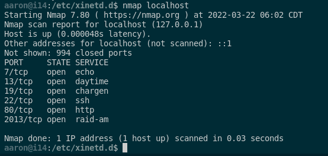
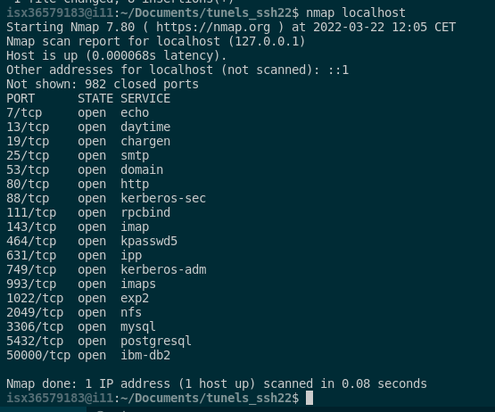
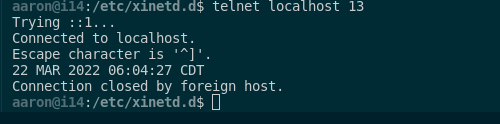

# Tunels SSH 2021-2022
## Aaron Andal ASIX M11 2021-2022

## **Modelo1: Tunel Directo**


<div style="padding: 5%">
    
</div>

## **Modelo2: Tunel Directo / Cerrando puerto de Internet**

<div style="padding: 5%">
    
</div>

## **Modelo3: Tunel Directo con Rebote**

<div style="padding: 5%">
    
</div>

## **Modelo4: Tunel Reverse**

<div style="padding: 5%">
    
</div>

## **Modelo5: Tunel Reverse con Rebote**

<div style="padding: 5%">
    
</div>

<br>
<br>
<br>

### XINETD

* Configuración de Xinetd

1. cd /etc/xinetd.d/

    `chargen` PORT 19 --> Disable No

    `daytime` PORT 7 --> Disable No

    `echo` PORT 13 --> Disable No

2. `systemctl stop xinetd` - `systemctl start xinetd`

3. Crear un nuevo servidor: `DAYTIME2 (PORT 2013)` `(En el HOST Destino)`

```diff
- 1. ssh aaron@10.200.243.214

- 2. su -l

- 3. cd /etc/xinetd.d/ && cp daytime daytime2

- 4. Dentro de `daytime2`:

service daytime2
{  
    disable     = no  
    type        = UNLISTED
    socket_type = stream
    protocol    = tcp
    wait        = no
    redirect    = 127.0.0.1 13
    bind        = 0.0.0.0 
    port        = 2013 
    user        = nobody
}

```

4. `nmap localhost` o `nmap 10.200.243.214` (Host DESTINO)

<div style="padding: 5%">
    
</div>


5. `nmap ip_publica` --> `nmap 10.200.243.211` (HOST LOCAL)

<div style="padding: 5%">
    
</div>

6. `telnet localhost 13` (HOST DESTINO)

> Hace el redirect

<div style="padding: 5%">
    
</div>


> CHEATS: TELNET QUIT = CTRL + CLAUDATOR --> telnet> quit

--------------------------------------------------------------------------------------

<br>
<br>
<br>

### **Ejemplo Apache2**

Tener instalado el `APACHE2`

`apt-get install apache2`

> Métodos de visualización: 

* Grafico:

    + `ip/index.html`

* Terminal:

    + `telnet localhost 80`

    + `echo "hola soc 2hisx" > /var/www/html/index.html`

    + `systemctl restart apache2`

    + `ESCRIBIR` --> `GET / HTTP / 1.0` --> `2 ENTERS`

        + GET = Coge la DOC RAÍZ index.html

<br>
<br>
<br>

### **EJEMPLO 1 (Modelo1)**

* Tener el DAYTIME / XINETD

1. Tener el Xinetd - Daytime configurado

ssh -L 50000:localhost:2013

> -L --> hace el BIND del puerto LOCAL al puerto que hemos creado de XinetD 'Daytime' 

<br>
<br>
<br>

#### **Tunel DIRECTO**

```diff
- text in red
+ text in green
! orange
# text in gray
@@ purple @@
```

```diff
- text in red
+ text in green
! orange
# text in gray
@@ Hola es una prueba @@
```


* `ssh -L 50000:localhost:2013 aaron@10.200.243.214`

 * `telnet localhost 50000`

* 

* 