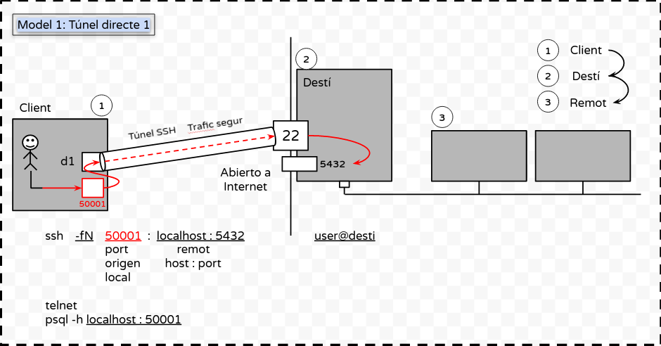
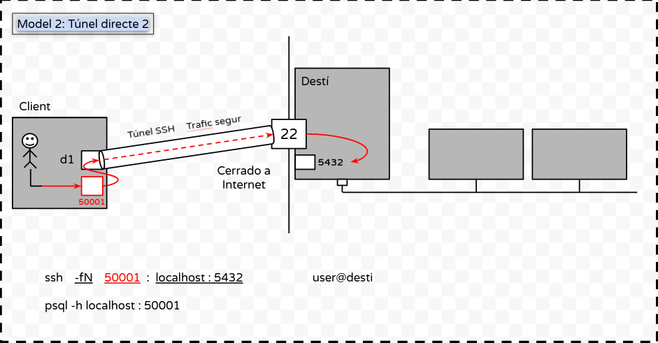
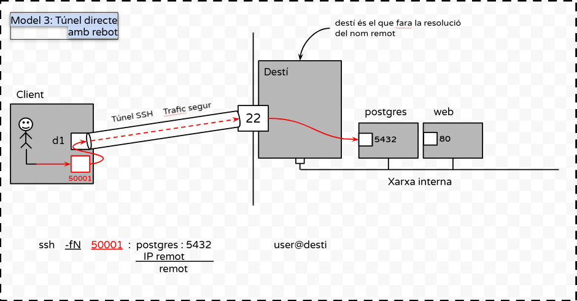
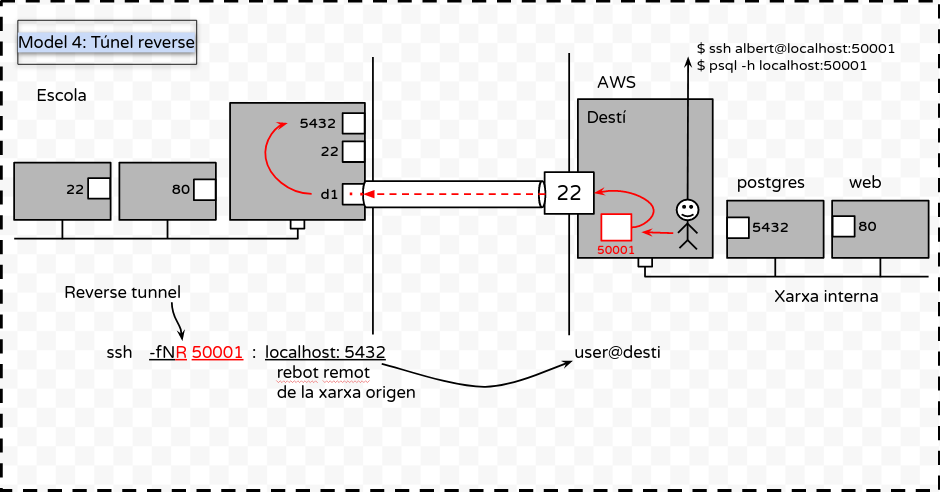
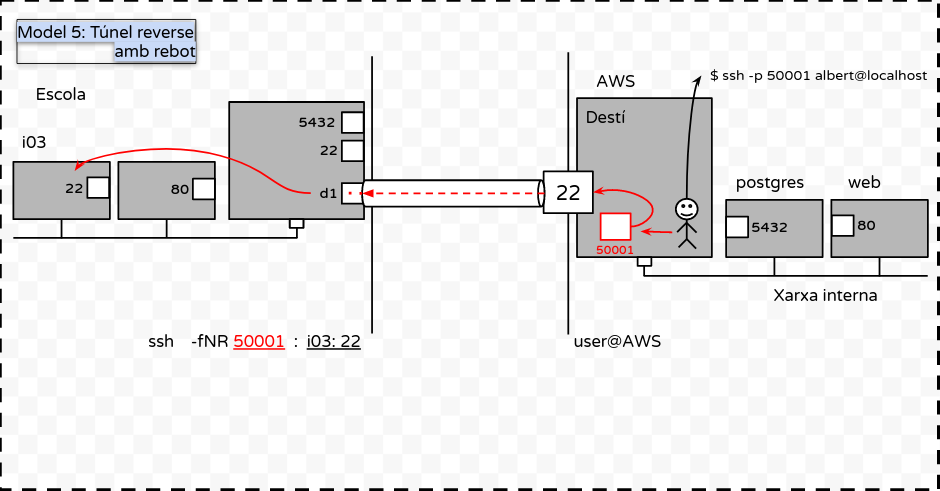

# Tunels SSH 2021-2022
## Aaron Andal ASIX M11 2021-2022

## **Modelo1: Tunel Directo**


<div style="padding: 5%">
    
</div>

## **Modelo2: Tunel Directo / Cerrando puerto de Internet**

<div style="padding: 5%">
    
</div>

## **Modelo3: Tunel Directo con Rebote**

<div style="padding: 5%">
    
</div>

## **Modelo4: Tunel Reverse**

<div style="padding: 5%">
    
</div>

## **Modelo5: Tunel Reverse con Rebote**

<div style="padding: 5%">
    
</div>

<br>
<br>
<br>

### XINETD

* Configuración de Xinetd

1. cd /etc/xinetd.d/

    `chargen` PORT 19 --> Disable No

    `daytime` PORT 7 --> Disable No

    `echo` PORT 13 --> Disable No

2. `systemctl stop xinetd` - `systemctl start xinetd`

3. `nmap localhost`

3.1 nmap ip_publica --> nmap 10.200.243.211

4. `telnet localhost 13`

> CHEATS: TELNET QUIT = CTRL + CLAUDATOR --> telnet> quit

--------------------------------------------------------------------------------------

<br>
<br>
<br>

### **Ejemplo Apache2**

> Métodos de visualización: 

* Grafico:

    + `ip/index.html`

* Terminal:

    + `telnet localhost 80`

    + `echo "hola soc 2hisx" > /var/www/html/index.html`

    + `systemctl restart apache2`

    + `ESCRIBIR` --> `GET / HTTP / 1.0` --> `2 ENTERS`

        + GET = Coge la DOC RAÍZ index.html

<br>
<br>
<br>

### **EJEMPLO 1 (Modelo1)**

* Tener el DAYTIME / XINETD

1. Tener el Xinetd - Daytime configurado

ssh -L 50000:localhost:2013

> -L --> hace el BIND del puerto LOCAL al puerto que hemos creado de XinetD 'Daytime' 

<br>
<br>
<br>

#### **Tunel DIRECTO**

```diff
- text in red
+ text in green
! orange
# text in gray
```

<span style="color: green"> Some green text </span>


* `ssh -L 50000:localhost:2013 aaron@10.200.243.214`

 * telnet localhost 50000

* 

* 